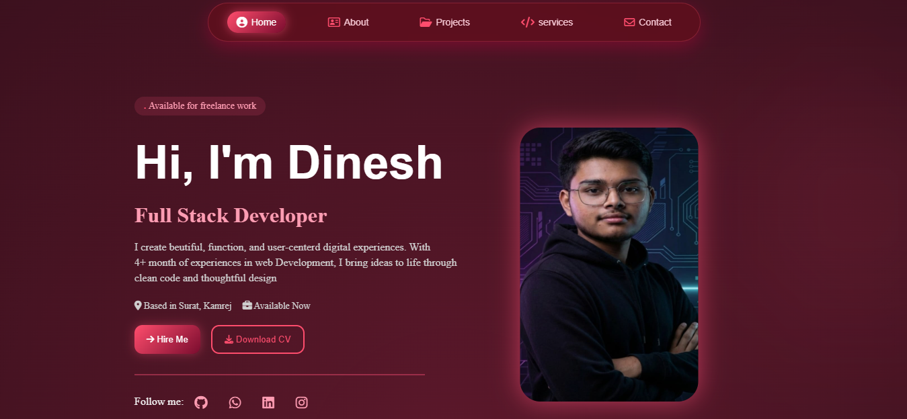

# 🚀 Java Portfolio – Sindhav Dinesh

Welcome to my **Java Portfolio Project** 🎯  
This portfolio showcases my Java skills, projects, and coding style.

---

## 👨‍💻 About Me

Hi, I'm **Sindhav Dinesh** 👋  
A passionate Java developer who loves building clean, logical, and efficient applications.

- Core Java
- OOP Concepts
- Problem Solving
- Basic Frontend Integration (if any)

---

## 🖼️ Portfolio Output (Preview)

> 📌 Add screenshots of your portfolio output below



📂 **Note:**  
Create an `images` folder inside your project and put your screenshots there.

---

## 🌐 Live Portfolio Website

🔗 **Live Demo:**  
👉 "https://sindhavdineshjavaportfoilio.netlify.app/"

_(Replace this with your actual deployed link)_

---

## 🛠️ Technologies Used

- Java
- OOP (Object Oriented Programming)
- Java Swing / JavaFX / Console (mention what you used)
- HTML / CSS (if used for UI)

---

## ▶️ How to Run This Project

1. Clone the repository
   ```bash
   git clone https://github.com/your-username/your-repo-name.git
